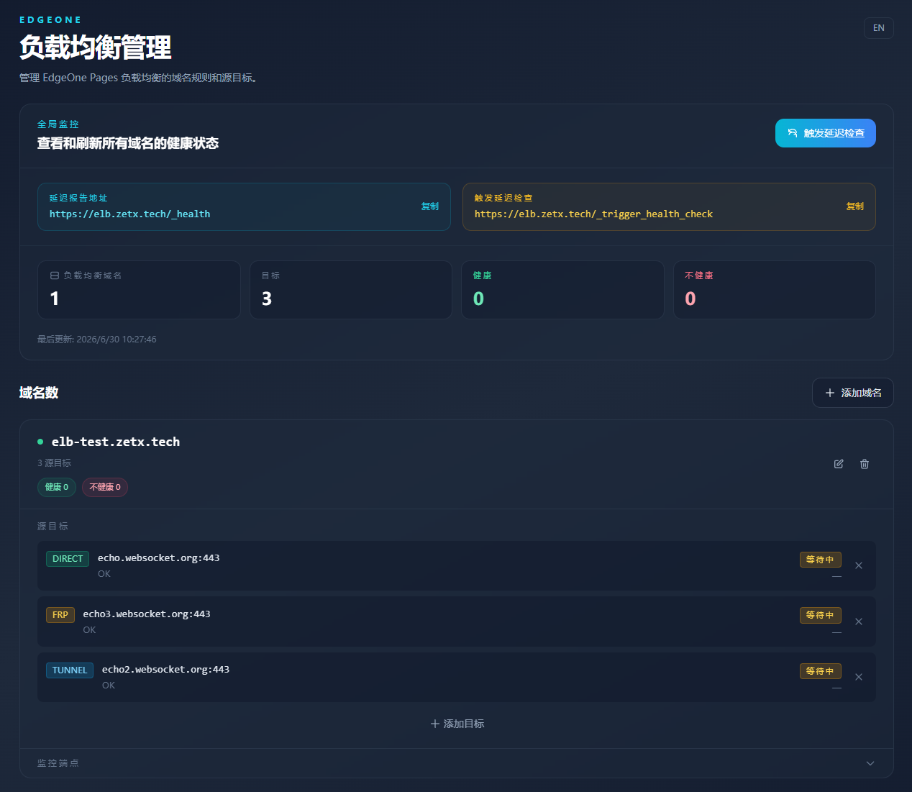

# EdgeOne Load Balancer

[中文](./README_zh-CN.md)

[](https://edgeone.ai/pages/new?repository-url=https%3A%2F%2Fgithub.com%2Fzetxtech%2Fedgeone-lb)

A load balancer running on EdgeOne Pages, with health-aware traffic routing and a built-in admin panel.



## Features

- **Multi-origin routing** — distribute traffic across FRP, Tunnel, or Direct targets with health-weighted selection
- **Health monitoring** — automatic background health checks with configurable failure detection per target type
- **Admin panel** — manage domains and origin targets through a bilingual (EN/ZH) web UI
- **Debug logging** — optional request tracing for troubleshooting

> **Note:** Due to EdgeOne Pages limitations on outbound connections, this project does not support WebSocket — HTTP traffic only.

## Origin Target Types

| Type | Description | Failure conditions |
|------|-------------|-------------------|
| **FRP** | FRP reverse proxy | SSL handshake error (525), connection timeout, FRP signature error page |
| **Tunnel** | EdgeOne Tunnel | 530/502 responses, connection timeout |
| **Direct** | Direct origin connection | Connection timeout, non-2xx/3xx HTTP response |

## Deployment

1. **Create a KV namespace** — Go to the EdgeOne console → Edge Functions → KV Storage and create a new namespace.

2. **Bind it to your Pages project** — In the Pages project settings, add a KV binding with variable name `lb_kv` and select the namespace you just created.

3. **Install, build, and deploy:**

   ```bash
   npm install
   npm run build
   edgeone pages deploy
   ```

4. **Configure DNS** — Point your proxy domains to the Pages project domain via CNAME.

5. Visit your admin domain to start adding rules and origin targets.

6. **Set up external monitoring** — Health checks only run when triggered by proxy requests. To keep latency data fresh, configure a service like [UptimeRobot](https://uptimerobot.com/), [Freshping](https://www.freshworks.com/website-monitoring/), or any HTTP monitor to periodically poll `/_trigger_health_check` (e.g. every 5 minutes) to ensure health status is always up to date.

## License

GNU General Public License v3.0
