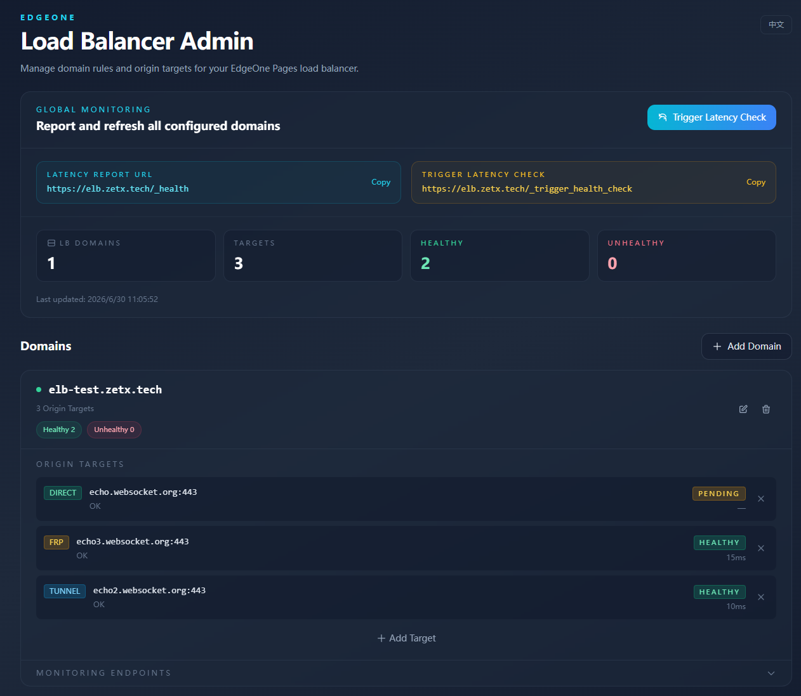

# EdgeOne Load Balancer

[中文 / Chinese README](./README_zh-CN.md) · 

A load balancer running on EdgeOne Pages, with health-aware traffic routing and a built-in admin panel.

## Features

- **Multi-origin routing** — distribute traffic across FRP, Tunnel, or Direct targets with health-weighted selection
- **Health monitoring** — automatic background health checks with configurable failure detection per target type
- **Admin panel** — manage domains and origin targets through a bilingual (EN/ZH) web UI
- **Debug logging** — optional request tracing for troubleshooting

> **Note:** Due to EdgeOne Pages limitations on outbound connections, this project does not support WebSocket — HTTP traffic only.

## Origin Target Types

| Type | Description | Failure conditions |
|------|-------------|-------------------|
| **FRP** | FRP reverse proxy | SSL handshake error (525), connection timeout, FRP signature error page |
| **Tunnel** | EdgeOne Tunnel | 530/502 responses, connection timeout |
| **Direct** | Direct origin connection | Connection timeout, non-2xx/3xx HTTP response |

## Deployment

Click the button above to deploy on EdgeOne Makers. After deployment, complete the following:

1. **Bind a KV namespace** — Go to EdgeOne Console → Makers → select your project → Storage → KV Storage, click "Bind namespace", set variable name to `lb_kv`, and select or create a KV namespace.

2. **Configure DNS** — In your domain's DNS settings, point the domains you want to load-balance (e.g. `api.example.com`) via CNAME record to the domain assigned by your Pages project.

3. **Set up external monitoring** — Health checks only run when traffic passes through the load balancer; without traffic, latency data goes stale. Use free monitoring services like [UptimeRobot](https://uptimerobot.com/) or [Freshping](https://www.freshworks.com/website-monitoring/) to create an HTTP monitor targeting `/_trigger_health_check` on your admin domain, with a 5-minute interval.

## License

GNU General Public License v3.0
